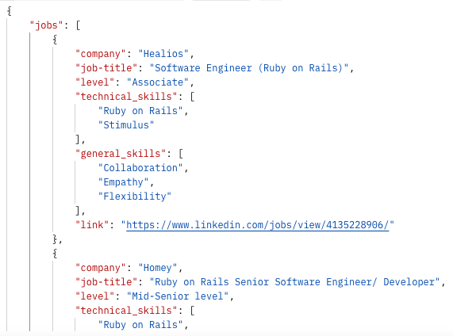

# Job scraping project

### Technologies used

- Python
- Django
- Beautiful Soup
- Flashtext

### Preview project
The request takes the parameter of programming language and will search for available jobs in London. 

It will then return important information about each role such as job title, company and level. It then takes the job description and filters this for keywords using using flashtext, and returns a list of technical and general skills needed for the role.

Once we have these details it creates a pie chart of the most popular skills needed from all of the roles, to give you an idea of what skills would be useful to learn or of upcoming trends. It then returns a base64 of the chart.

